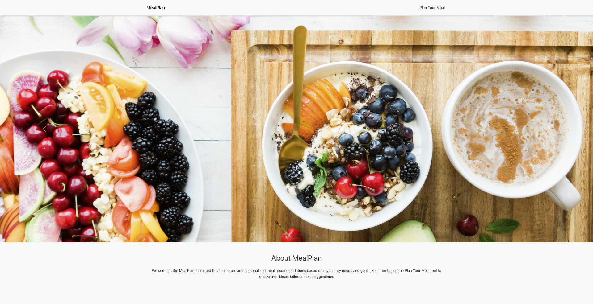

# MealPlan - Recipe Recommender

[](assets/MealPlanDemo.mp4)

[[View Demo]](assets/MealPlanDemo.mp4)

**MealPlan** is a personalized meal recommendation tool I built to help assist me in planning my meals effectively and meet my dietary goals using a combination of nutritional science and machine learning.

## Features

- **Personalized Meal Recommendations**: Generates meal suggestions based on user-inputted criteria such as age, weight, height, activity level, and dietary goals.
- **Data-Driven Insights**: Utilizes a rich dataset to offer recommendations that are both nutritious and tailored to user preferences.
- **Interactive Web Interface**: Easy-to-use web interface, allowing for a seamless user experience.

## Technologies Used

- **LLM**: Llama 3.2 (orchestration via Ollama and LangChain)
- **Data Processing and ML**: Python, Pandas, Scikit-Learn for generating and refining meal recommendations.
- **Frontend**: React with React-Bootstrap and custom CSS for a clean, intuitive user interface.
- **Navigation**: React Router for seamless page transitions.
- **Backend**: FastAPI to handle API requests and deliver meal recommendations.

---

## Prerequisites

- [Python 3.10+](https://www.python.org/downloads/)
- [Node.js and npm](https://nodejs.org/)
- [Docker](https://www.docker.com/)
- [Ollama](https://ollama.com/)

For Llama 3.2 models:

- Option 1 (Docker): Install the llama3.2:1b model by downloading and running Ollama as a Docker service. Follow the instructions in the [Ollama Docker guide.](https://ollama.com/blog/ollama-is-now-available-as-an-official-docker-image)
- Option 2 (Local): Download the llama3.2:latest model by following the instructions [here.](https://ollama.com/blog/llama3.2)

---

## Running the App via Docker (Option 1 - Recommended)

***Note: In this option, we are using LLama3.2 1B model (`llama3.2:1b`)***

1. **Build and Start the App**:
   - Use Docker Compose to build and start all required services:
     ```bash
     docker-compose up --build
     ```
   - This will start three services:
     - **Frontend**: Available at [http://localhost:3000](http://localhost:3000)
     - **Backend**: Exposes API at [http://localhost:8000](http://localhost:8000)
     - **Ollama Service**: Runs the required LLM models locally.

2. **Load the Correct LLM Locally**:
   - After starting the containers, you need to load the `llama3.2:1b` model in the Ollama service. Run the following command in a terminal:
     ```bash
     docker exec -it diet_recommendation-ollama-1 ollama run llama3.2:1b
     ```
   - This ensures the correct model is ready to process requests.

3. **Access the App**:
   - Navigate to [http://localhost:3000](http://localhost:3000) to use the app.
   - Access [http://localhost:8000/docs](http://localhost:8000/docs) for API documentation.

---

## Running the App Locally (Option 2)

***Note: In this option, we are using LLama3.2 3B model (`llama3.2:latest`)***

1. **Start the Backend**:
   - Open a terminal, navigate to the `backend` directory, and start the FastAPI server with:
     ```bash
     uvicorn app.main:app --reload --port 8000
     ```

2. **Start the Frontend**:
   - In a new terminal window, navigate to the `frontend` directory and start the React development server:
     ```bash
     npm start
     ```

3. **Access the App**:
   - Go to [http://localhost:3000](http://localhost:3000) in your browser to use the app.

---

## Future Goals

- **Enhanced Recommendations**: The current recommendation model is quite basic, and future updates aim to incorporate language models and advanced recommendation techniques to provide more nuanced and personalized meal recommendations.
