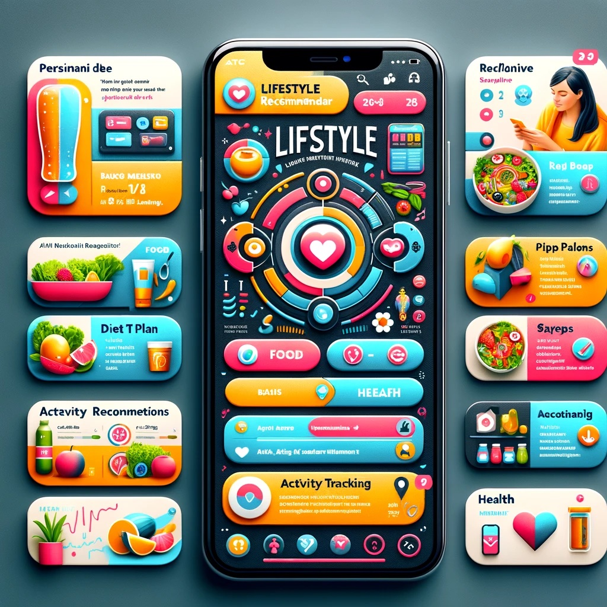

# Lifestyle Recommender



The Lifestyle Recommender is a Python-based system designed to provide personalized diet recommendations. Utilizing a combination of nutritional science and user preferences, this tool aims to assist users in planning their meals effectively to meet their dietary goals.

## Features

- **Personalized Meal Recommendations**: Generates meal suggestions based on user-inputted criteria such as age, weight, height, activity level, and dietary goals.
- **Data-Driven Insights**: Utilizes a rich dataset to offer recommendations that are both nutritious and tailored to user preferences.
- **Interactive Web Interface (TODO)**: Easy-to-use web interface, allowing for a seamless user experience.

## Technologies Used

- **Back-End**: FastAPI
- **Front-End**: React 
- **Containerization**: Docker (TODO)
- **Data Processing**: Python, Pandas

### Prerequisites

- [Python 3.8+](https://www.python.org/downloads/)
- [Node.js and npm](https://nodejs.org/)

### Running the App Locally

1. **Start the Backend**:
   - Open a terminal, navigate to the `backend` directory, and start the FastAPI server with:
     ```bash
     uvicorn app.main:app --reload --port 8000
     ```

2. **Start the Frontend**:
   - In a new terminal window, navigate to the `frontend` directory and start the React development server:
     ```bash
     npm start
     ```

   The frontend will be available at `http://localhost:3000`.

### Usage

- Go to `http://localhost:3000` in your browser to access the app.